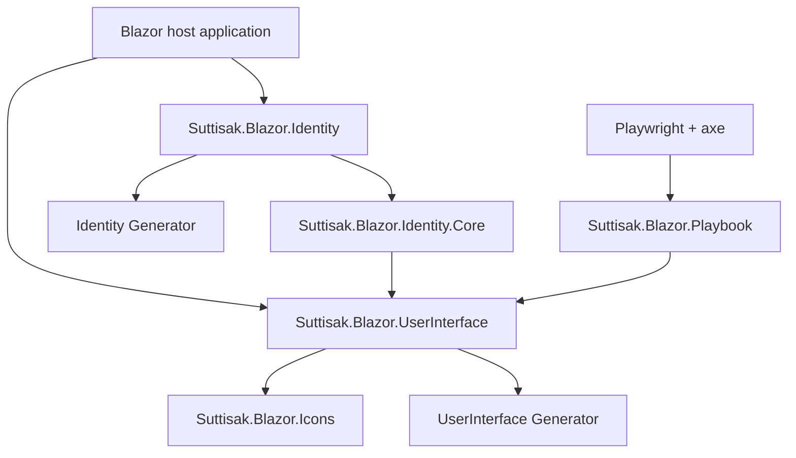

<div align="center">

# Suttisak.Blazor

**A source-available Blazor design system, executable component workbench, and reusable identity toolkit for .NET 10.**

[](https://github.com/Lukespacewalker/Suttisak.Blazor/actions/workflows/ci.yaml)
[](https://github.com/Lukespacewalker/Suttisak.Blazor/actions/workflows/secret-scan.yaml)
[](https://github.com/Lukespacewalker/Suttisak.Blazor/releases)
[](https://dotnet.microsoft.com/)
[](.github/dependabot.yml)
[](#copyright-and-use)

</div>

> [!IMPORTANT]
> **Source availability:** This repository is publicly visible for transparency, evaluation, collaboration, and development. It is **not currently offered under an open-source license**. Copyright is retained by the repository owner; see [Copyright and use](#copyright-and-use).

## What is in the repository

| Area | Purpose |
|---|---|
| `Suttisak.Blazor.UserInterface` | Shared application components, form primitives, data display, overlays, navigation, layouts, marketing, and reader-facing experiences. |
| `Suttisak.Blazor.Icons` | Dependency-free SVG icon components used by the design system. |
| `Suttisak.Blazor.Identity.Core` | Shared identity UI primitives and navigation contracts. |
| `Suttisak.Blazor.Identity` | Reusable ASP.NET Core Identity pages, regions, and route adapters. |
| `*.Generator` | Roslyn source generators that remove repetitive host wiring. |
| `Suttisak.Blazor.Playbook` | Human-readable design-system documentation and executable component specimens. |
| `Suttisak.Blazor.Playbook.E2ETests` | Chromium, interaction, responsive, and axe accessibility regression coverage. |

The Playbook maintains a metadata-driven catalog of **90 components**. Every component has a stable detail route, while executable specimens are being added progressively to test real browser behavior rather than static screenshots.

## Quick start

### Run the Playbook

Prerequisites:

- .NET SDK 10
- Node.js 24 only when running the browser test suite

```bash
git clone https://github.com/Lukespacewalker/Suttisak.Blazor.git
cd Suttisak.Blazor

dotnet restore Suttisak.Blazor.slnx
dotnet run --project Suttisak.Blazor.Playbook/Suttisak.Blazor.Playbook.csproj
```

The Playbook exposes:

- `/catalog` for searchable component discovery
- `/components` for the Component Browser
- `/components/{slug}` for deep-linkable component documentation
- `/foundations` for semantic design tokens
- `/guidelines` for accessibility, theming, responsive behavior, and maturity rules
- `/component-manifest.json` for agents and tooling

### Consume a package

Packages are currently distributed through GitHub Packages. Configure the GitHub NuGet feed for your account, then reference the package needed by the host application.

```xml
<ItemGroup>
  <PackageReference Include="Suttisak.Blazor.UserInterface" Version="0.26.2" />
  <PackageReference Include="Suttisak.Blazor.Identity" Version="0.9.1" />
</ItemGroup>
```

Feed:

```text
https://nuget.pkg.github.com/LukeSpacewalker/index.json
```

### Compose shared UI

```razor
@using Suttisak.Blazor.UserInterface.Components.Common

<AppStack Gap="1rem">
    <AppButton Variant="AppButtonVariant.Primary"
               IconStartName="Add"
               OnClick="CreateAsync">
        Create record
    </AppButton>

    <FeedbackBanner Intent="FeedbackIntent.Success">
        The record was created.
    </FeedbackBanner>
</AppStack>
```

## Architecture



Applications retain ownership of product copy, routing decisions, branding, and domain behavior. The shared libraries own reusable presentation contracts, accessibility behavior, and integration seams.

## Identity route adapters

Add `Suttisak.Blazor.Identity.Generator` as an analyzer to the host and request generated non-generic route components once:

```csharp
[assembly: GenerateIdentityRouteAdapters(
    typeof(ApplicationUser),
    Namespace = "MyApp.Identity")]
```

The generator supplies reusable account and manage routes. The host keeps ownership of `/Account/Register`, so it can use its own input model and derive from `RegistrationPage<TUser, TInput>` when needed.

Wrap the application router with `IdentityUiProvider` to add application-owned branding without coupling the package to product assets:

```razor
<IdentityUiProvider>
    <Brand>Your product mark</Brand>
    <LoginShowcase>Your sign-in showcase</LoginShowcase>
    <AccountHelp>Your support link</AccountHelp>
    <IdentityFooter>Your legal footer</IdentityFooter>
    <ChildContent>
        <Routes />
    </ChildContent>
</IdentityUiProvider>
```

## Quality gates

| Gate | Scope |
|---|---|
| Solution build | All projects on .NET 10 |
| bUnit | Fast shared-component behavior |
| Playwright | Compiled WebAssembly application in Chromium |
| axe | Serious and critical WCAG regressions |
| Gitleaks | Full reachable Git history |
| NuGet pack | Package production validated before release |
| Dependabot | NuGet, npm, and GitHub Actions updates |

Run the fast component suite:

```bash
dotnet test Suttisak.Blazor.UserInterface.Tests/Suttisak.Blazor.UserInterface.Tests.csproj
```

Run the browser suite:

```bash
cd Suttisak.Blazor.Playbook.E2ETests
npm ci
npm run install:browsers
npm test
```

## Release process

- Pull requests run read-only build, unit, browser, accessibility, and full-history secret checks.
- Pushes to `master` run CI and validate that all distributable packages can be packed.
- Release Drafter maintains the next GitHub Release notes from merged pull requests.
- Publishing a GitHub Release triggers a fresh verification run, publishes new package versions to GitHub Packages, and attaches `.nupkg` and `.snupkg` files to the release.
- The intended `master` protection policy is versioned in [`.github/branch-protection.json`](.github/branch-protection.json).

## Documentation

- [User interface overview](Suttisak.Blazor.UserInterface/README.md)
- [Agent guidance](Suttisak.Blazor.UserInterface/AGENTS.md)
- [Marketing components](Suttisak.Blazor.UserInterface/Components/Marketing/README.md)
- [Reader/result experience components](Suttisak.Blazor.UserInterface/Components/Experience/README.md)
- [Contribution guide](CONTRIBUTING.md)
- [Security policy](SECURITY.md)
- [Branch protection policy](.github/BRANCH_PROTECTION.md)

## Contributing and security

Read [`CONTRIBUTING.md`](CONTRIBUTING.md) before opening a pull request. Security-sensitive reports must follow [`SECURITY.md`](SECURITY.md) and must never be posted in a public issue or pull request.

## Copyright and use

Copyright © Suttisak Denduangchai. All rights reserved.

No open-source license is currently granted for this repository. Public access to the source code does not grant permission to copy, modify, distribute, sublicense, sell, or otherwise reuse the software outside permissions that arise directly from GitHub's Terms of Service or separate written authorization from the copyright holder.

If an open-source license is adopted in the future, it will be published explicitly in this repository and will apply according to its own terms.
